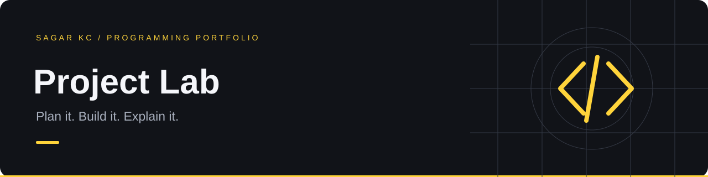

# Project Lab

A home for larger project plans and architecture notes. The working web applications each have their own repository.

## Recommended next build: DeskFlow

An **IT service-desk and asset tracker**: create tickets, assign technicians, manage priorities, link devices, and track resolution history. A later full-stack version would add authenticated roles and a database.

**Status: planned.** No completed DeskFlow application is claimed here.

[Read the milestones, data model, and acceptance criteria →](./ROADMAP.md)

## Other substantial ideas

| Project | Real problem | Technical depth |
| --- | --- | --- |
| ShiftBoard | Restaurant scheduling and shift swaps | Conflict detection, approvals, date/time handling |
| GameShelf | Organize a game backlog and reviews | Account-owned data, APIs, filtering, caching |
| ArenaLab | A playable C# arena game | Game loop, collisions, state machines, saves |

## Working applications

- [tori&co Gaming Store](https://github.com/Sagarkhatriii/gaming-store) · [Public demo](https://nexus-gaming-sagar.tunedboar9.chatgpt.site)
- [Weather Explorer](https://github.com/Sagarkhatriii/weatherapp)
- [Calc Studio](https://github.com/Sagarkhatriii/calculator-app)
- [Tic-Tac-Toe](https://github.com/Sagarkhatriii/tic-tac-toe)

The `gaming-store/` and `tic-tac-toe/` directories are earlier snapshots. Use the separate repositories above for current versions.
